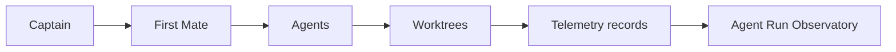

# Agentic Coding Test

This repository is used to test the multi-agent development environment.

## Multi-Agent Development Environment

The repository is used to test isolated worktrees, OpenCode workers, OpenRouter free routing, Codex escalation, tmux supervision, and Treehouse leasing.
GNHF final smoke verified

## Agent Run Observatory

First Mate automatically writes one append-only JSON record per completed run to
`.agent-runs/<run_id>.json`. Records contain the agent and dynamically available
model/provider metadata, a hashed task identifier, branch and worktree, start and
finish times, duration, final status, test outcome, files and lines changed, and
commits created. Full prompts, conversations, credentials, secrets, and environment
variable contents are not collected. Optional values may be `null`, and telemetry
failures never change the result of the underlying agent run.

Run the observatory report from the repository root:

```console
./scripts/agent-stats
```

Example output:

```text
AGENT RUN OBSERVATORY
=====================
Total runs:       4
Successful runs:  3
Failed runs:      1
Success rate:     75.0%
Average duration: 92.5s

By agent:
  codex: 1 runs, 100.0% success
  opencode: 3 runs, 66.7% success

Files changed:    9
Lines added:      184
Lines removed:    37
Commits created:  4
Runs with tests:  3
Tests passed:     3
```

The report skips malformed records rather than failing. This lightweight history
makes it possible to compare agent reliability, test usage, run time, and change
size across the multi-agent workflow without retaining sensitive task content.


