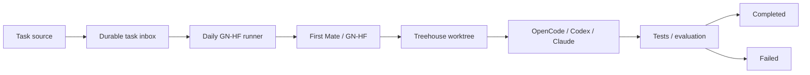

# Autonomous Daily GN-HF Runner

The daily runner is a small, durable scheduling and queue layer in front of the
existing First Mate and GN-HF workflow. It decides which eligible task starts
and when. First Mate, Captain, Treehouse, the worker agents, tests, and evaluation
continue to decide how the engineering task is performed.



## Storage and task source boundary

Runtime state lives in the ignored `.agent-tasks/` directory. Its `pending/`,
`running/`, `completed/`, and `failed/` directories are the durable state
machine. Prompt bodies live separately in `prompts/`. Files and directories are
created with private permissions. State records do not copy prompt contents or
environment variables.

A producer only needs to create a task through `enqueue`:

```console
./scripts/daily-gnhf enqueue task.md --date 2026-09-22 --title "Daily maintenance"
```

The resulting ID is deterministically `daily-2026-09-22`, so another producer
cannot enqueue a second daily task for that date. Metadata includes the task ID,
date, title, relative prompt reference, lifecycle timestamps, attempt count,
run ID, branch, commit, worktree, exit code, and evaluation result when those
values are available. Producers must not place credentials in prompts or task
metadata.

This contract keeps task generation independent from execution. A future source
can call the same enqueue boundary without changing runner logic. For example, a
GitHub bridge could select one issue carrying a `daily-gnhf` label, enqueue its
sanitized task, let the runner produce a branch or pull request through the
existing workflow, and then update the issue with the run result. The local
queue itself has no GitHub dependency.

## Lifecycle, locking, and safety

The lifecycle is `PENDING -> RUNNING -> COMPLETED` or `FAILED`. A failed task can
return to `PENDING` only through an explicit retry. Terminal records are retained
as history. Completed tasks are never selected again.

Queue mutations use a Linux advisory file lock and atomic file replacement or
rename. This serializes timer, manual, and concurrent runner invocations. A
single running record also enforces the configured sequential execution mode.
Before claiming a task, the runner validates its JSON, deterministic ID and
date, state, prompt location and existence, eligibility date, and attempt limit.
The prompt is passed as one literal subprocess argument to First Mate. Neither
prompt text nor metadata is evaluated as shell input.

The runner invokes the repository's narrow interface:

```text
scripts/first-mate gnhf --repo REPOSITORY --check CHECK \
  --run-id-file FILE PROMPT
```

First Mate launches asynchronously. A successful launcher therefore leaves the
task `RUNNING`; it does not mean the engineering work succeeded. On later `run`
or `catch-up` invocations, the runner reconciles the linked Captain runtime
status. Captain `review`, `accepted`, `integrated`, and `released` states complete
the task, while Captain `failed` fails it. Available run ID, branch, worktree,
and accepted or integrated commit are retained. The run ID links the task to the
existing Agent Run Observatory. The `evaluation` field remains separate from
execution status and is null unless a clean existing integration provides a
result. Completion never authorizes an automatic merge.

Old running records with no observable Captain lifecycle are reported under
`stale_running` by `status`. The default threshold is 24 hours. The runner does
not guess that an old process failed and does not automatically retry it. Inspect
the task and Captain runtime first. Recovery currently requires resolving the
linked Captain run or carefully repairing the queue as an operator; there is no
automatic stale recovery command.

## Commands

Commands emit structured JSON on standard output and diagnostics on standard
error.

```console
./scripts/daily-gnhf status
./scripts/daily-gnhf run
./scripts/daily-gnhf catch-up
./scripts/daily-gnhf history --limit 20
./scripts/daily-gnhf show daily-2026-09-22
./scripts/daily-gnhf retry daily-2026-09-22
```

`show` returns validated metadata but never the prompt body. `retry` accepts only
a failed task below `max_attempts`, preserves a compact failure history, and
clears prior run-specific fields before returning it to pending. Launcher errors
atomically move a claimed task to failed and preserve the exit code. Malformed
metadata and missing or unsafe prompts fail closed without launching an agent.

`status` treats pending dates before today as missed. Given pending tasks for
2026-09-20, 2026-09-21, and 2026-09-22 on September 22, only the first two are
missed. `catch-up` selects missed tasks oldest first and observes
`max_catch_up_tasks`. Because First Mate is asynchronous and execution is
sequential, it normally launches one task and leaves later tasks pending for a
future invocation.

## Configuration

Safe defaults are in `config/daily-gnhf.json`. They enable sequential execution,
oldest-first catch-up, at most one catch-up task per invocation, and three total
attempts. `auto_push` and `auto_merge` are false. The runner does not implement
automatic merge or contribution-generating behavior. `acceptance_check` is a
repository-controlled command passed to First Mate, never sourced from task
metadata.

## Scheduling and WSL2

Example user-level systemd units are provided but are not installed or enabled
automatically. See [Daily GN-HF systemd scheduling](daily-gnhf-systemd.md) for
copying the units, replacing the repository placeholder, enabling the timer,
viewing logs and timers, and removing the schedule.

The timer uses `Persistent=true`. If its evening activation is missed while the
user manager is unavailable, systemd can trigger one activation when the manager
returns. The queue's catch-up policy then chooses at most the configured number
of missed tasks. It cannot execute while a computer is powered off. In WSL2,
systemd and its user manager must be enabled and the WSL environment must be
running. Windows shutdown, sleep, or a stopped WSL virtual machine prevents
execution; persistence only supports catch-up after the environment returns.
