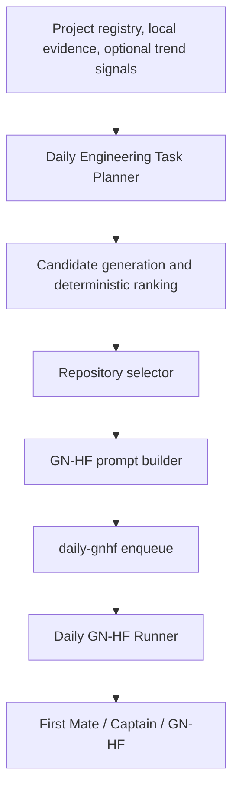

# Daily Engineering Task Planner

The Daily Engineering Task Planner chooses what bounded engineering work should
be queued and which registered repository should receive it. It does not run
GN-HF, create repositories, merge changes, or replace the Daily GN-HF Runner.



The planner owns WHAT and WHERE. The runner owns WHEN and WHICH queued task.
First Mate, Captain, and GN-HF own HOW the selected task is implemented.

## Quick start

Run commands from the repository root. `--json` is a global option and must
appear before the subcommand.

```console
./scripts/daily-planner status
./scripts/daily-planner projects
./scripts/daily-planner candidates
./scripts/daily-planner plan
./scripts/daily-planner history
./scripts/daily-planner show plan-2026-09-23
./scripts/daily-planner enqueue plan-2026-09-23
```

`candidates` is read-only and explains score components, recent-work penalties,
rejections, and repository decisions. `plan` persists the deterministic identity
`plan-YYYY-MM-DD` under `.agent-planner/plans/` but does not enqueue it. Repeating
`plan` on the same date returns the persisted plan. Use `plan --refresh` when a
human explicitly wants changed evidence to replace today's plan. An enqueued
plan cannot be refreshed because its receipt identifies the task already accepted
by `daily-gnhf`.

`enqueue` is always explicit. It passes a persisted executable plan to the real
`scripts/daily-gnhf enqueue` interface exactly once and records the returned task
ID. It never launches GN-HF. Repeating the command returns the stored receipt
without enqueueing another task. A `NO_TASK` plan or new-repository recommendation
cannot be enqueued.

## Project registry

`config/engineering-projects.json` is the durable, human-edited registry. It is
seeded only with this repository. Add another repository by adding an object to
the `projects` array with these fields:

```json
{
  "id": "example-project",
  "name": "Example Project",
  "path": "../../example-project",
  "repository_url": "https://example.invalid/owner/example-project",
  "purpose": "A concise description of the repository boundary",
  "tags": ["developer-platform"],
  "maturity": "developing",
  "active": true,
  "task_categories": ["developer-tooling", "reliability"],
  "priority": 0,
  "notes": "Optional operator notes"
}
```

Paths are resolved relative to the `config` directory, not the current shell
directory. Each active path must resolve to the exact root of a local Git
repository before Git evidence is collected. Symlinks, path escapes, unavailable
paths, and nested paths are not silently followed. Valid maturity values are
`experimental`, `developing`, `stable`, and `mature`. Inspect the result with
`daily-planner projects` before planning.

## Evidence and context limits

The planner gathers only configured, bounded metadata:

- recent commit hashes, timestamps, subjects, and top-level changed areas
- pending, running, and terminal daily task metadata through `daily-gnhf`
- minimal Agent Run Observatory metadata
- minimal Shared Agent Memory results through its existing read-only CLI
- optional structured trend signals

It does not recursively ingest repositories or retain complete README files,
prompts, memory provenance, credentials, `.env` files, SSH keys, cloud credential
directories, browser profiles, or arbitrary home-directory data. Evidence limits,
candidate limits, prompt size, scoring weights, and new-repository policy are in
`config/daily-planner.json`.

Planner operation does not depend on Shared Agent Memory or trend signals being
available. Unavailable registered repositories remain inspectable but do not
produce candidates.

If the memory CLI is missing, times out, or exits unsuccessfully, the planner
continues without memory evidence and reports a bounded reason. A successful but
malformed memory response remains an error rather than being silently ignored.

## Optional trend signals

Trend research happens outside the planner. Place one JSON object per regular,
non-symlinked file in `.agent-planner/signals/`. For example:

```json
{
  "signal_id": "signal-2026-09-23-evaluation",
  "observed_at": "2026-09-23T14:00:00+00:00",
  "source_type": "human-research",
  "topic": "Agent evaluation reliability",
  "summary": "Teams are emphasizing reproducible evaluation evidence.",
  "tags": ["agents", "reliability"],
  "relevance_hint": "Relevant to existing evaluation infrastructure.",
  "provenance": "Manually supplied research note"
}
```

Signals are untrusted data. The planner validates their schema and size, uses
tags for bounded relevance, and records signal IDs as evidence references. It
does not execute signal content or copy arbitrary signal prose into a GN-HF
prompt. Malformed, oversized, symlinked, and duplicate signals are rejected.

## Ranking, novelty, and repository selection

Candidate templates are curated by task category. Ranking is deterministic and
uses the centralized weights for project relevance, engineering usefulness,
novelty, readiness, bounded scope, trend relevance, project priority, and a
recent-work penalty. Stable candidate IDs break score ties. No random choice,
LLM classifier, paid API, or external service is involved.

Recent commits, daily tasks, agent runs, and memory summaries contribute exact
fingerprint or bounded normalized-word overlap checks. Substantial repetition is
penalized or rejected, and the reason is visible in `--json candidates` output.
A day without a sufficiently useful candidate may persist `NO_TASK`; nothing is
enqueued in that case.

The selector prefers an active existing project whose declared purpose,
categories, and capabilities fit the candidate. An independently useful
capability may produce a proposed name, purpose, and rationale only when the
configured new-repository policy and threshold allow it. That result always
requires human action. The planner never creates a repository automatically.

## State and safety

Runtime state is repository-local under the gitignored `.agent-planner/`
directory. Plan writes and enqueue receipts use Linux locking and atomic file
replacement. State, registry, and configuration are strictly validated. Evidence
text is treated as data and is never turned into a shell command. Subprocesses
use fixed argument vectors, timeouts, and output limits.

The generated GN-HF prompt contains the role, target project, problem, context,
objective, required behavior, constraints, integration and safety requirements,
tests, acceptance criteria, documentation expectations, and a conventional
commit recommendation. Prompt creation fails rather than truncating away safety
or test requirements when the configured byte limit is exceeded.

`automatic_enqueue` defaults to `false`. Changing it does not make an interactive
`plan` command execute GN-HF. Optional scheduled planning and conditional enqueue
should use a separate user-level systemd workflow; no timer is installed by the
repository. See [Daily planner systemd scheduling](daily-planner-systemd.md) for
the optional 19:30 local-time example and WSL2 limitations.

## Troubleshooting

- `planner is disabled`: set `enabled` to `true` only after reviewing the config.
- `repository is unavailable`: correct the registry path and confirm it is the
  exact Git root, then rerun `projects`.
- `cannot read trend signal`: validate the JSON schema, timestamp timezone, file
  size, and that neither the directory nor file is a symlink.
- `plan already exists`: inspect it with `show`; use `plan --refresh` only when
  intentional evidence changes justify replacing it.
- `plan cannot be enqueued`: only a `PLANNED` existing-repository decision with a
  persisted prompt crosses the enqueue boundary.
- malformed planner state: preserve the file for diagnosis and repair or remove
  only the specific invalid plan after confirming it is not the enqueue record
  you need. Do not delete the whole state directory as a routine fix.

On WSL2, all manual commands work normally. User systemd automation requires a
distribution with systemd enabled, and timers run only while the WSL environment
and its user manager are available. A powered-off, sleeping, or stopped WSL
environment cannot plan or enqueue tasks.
